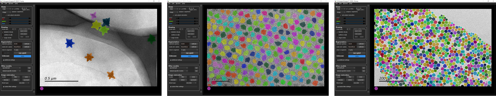

# 
  <b>Sophon </b> 

A generalist algorithm for nanocrystal segmentation in transmission electron microscopy (TEM) images (v1.0).

Software is available at [Baidu Disk (提取码：gbnt)](https://pan.baidu.com/s/1Q_3n1sHRCqzB56Sz54JSqw) and [Google Drive](https://drive.google.com/file/d/1-klszlNdlVBu8xbInkTYjnsokVglEOtr/view?usp=drive_link).

## Comparison with Cellpose

Cellpose:

Ours:

## Train your own model

Please refer to [Training Installation](train/README.md) for installation instructions.

## How to use our software

Please refer to [Software Usage](docs/software.md) for software usage.

## Acknowledgments
* The code is heavily borrowed from [Cellpose](https://github.com/MouseLand/cellpose), we thank the authors for their great effort.