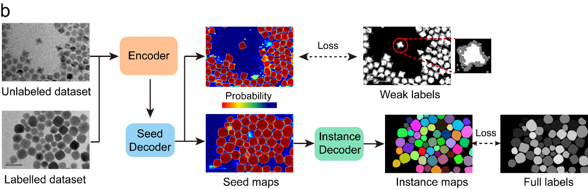
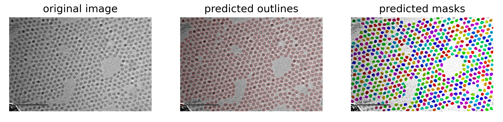

# <p>  <b>Sophon </b> </p>

[Paper]() | [Dataset]()

- News: Sophon software v2.1 released at [https://github.com/Sharpiless/Nanocrystals-TEM-segmentation/releases/tag/v2.1](https://github.com/Sharpiless/Nanocrystals-TEM-segmentation/releases/tag/v2.1)

## Abstract

Sophon is a robust model for nanocrystal segmentation in transmission electron microscopy (TEM) images. The model was trained on large-scale mixed datasets along with large amount of unlabeled TEM image data. Besides, with our carefully designed weak label generation pipeline and weakly supervised learning process, our segmentation model achieves superior performance for robust nanocrystal segmentation.

We show the learning process in the following:



## Dataset preparation

| Datasets         | Type         | Num of Images | Number of Instances | Link      |
| ---------------- | ------------ | ------------- | ------------------- | --------- |
| Ours (labeled)   | Nanocrystals | 523           | 49,976              | Manual    |
| Ours (unlabeled) | Nanocrystals | 7344          | 918,531             | Automatic |
| Extra Data 1     | Nanocrystals | 80            | 8,881  | [Workflow towards automated segmentation of agglomerated, non-spherical particles from electron microscopy images using artificial neural networks](https://www.nature.com/articles/s41598-021-84287-6) |
| Extra Data 2     | Cell         | 540           | 67,724 | [Cellpose: a generalist algorithm for cellular segmentation](https://www.nature.com/articles/s41592-020-01018-x) |
| Extra Data 3     | Cell         | 493           | 1,885  | [An Instance Segmentation Dataset of Yeast Cells in Microstructures](https://christophreich1996.github.io/yeast_in_microstructures_dataset/) |
| Extra Data 4     | Cell         | 200           | 23,615 | [Evaluation of Deep Learning Strategies for Nucleus Segmentation in Fluorescence Images](https://pubmed.ncbi.nlm.nih.gov/31313519/) |
| Extra Data 5     | Nanocrystals | 93            | 1,763  | [nNPipe: a neural network pipeline for automated analysis of morphologically diverse catalyst systems](https://www.nature.com/articles/s41524-022-00949-7) |
| Extra Data 6     | Virus        | 622           | 3,192  | [VISN: virus instance segmentation network for TEM images using deep attention transformer](https://pubmed.ncbi.nlm.nih.gov/37903415/) |
| Extra Data 7     | Cell         | 665           | 30,704 | [Nuinsseg: A fully annotated dataset for nuclei instance segmentation in h&e-stained histological images](https://www.nature.com/articles/s41597-024-03117-2) |
| Extra Data 10    | Cell         | 30            | 8,251  | [CryoNuSeg: A dataset for nuclei instance segmentation of cryosectioned H&E-stained histological images](https://www.sciencedirect.com/science/article/pii/S0010482521001438) |
| Extra Data 11    | Cell         | 1169          | 81,915 | [Blood Cell Segmentation Dataset](https://www.kaggle.com/datasets/jeetblahiri/bccd-dataset-with-mask) |
| Extra Data 12    | Nanocrystals | 465           | 11,541 | [Bayesian Particle Instance Segmentation for Electron Microscopy Image Quantification](https://pubs.acs.org/doi/full/10.1021/acs.jcim.0c01455) |


## Performance

We show the performance on our validation dataset. "OD" indicates our labeled dataset, "W" indicates weakly supervised learning on unlabeld data, and "LD" indicates extra datasets:

| Category | AP_50 | AP_75 | AP_90 | mIoU |
|----------|-------|-------|-------|------|
| OD       | 68.5  | 51.6  | 12.1  | 69.3 |
| OD+W     | 80.1  | 66.3  | 18.1  | 81.9 |
| OD+LD    | 81.3  | 72.8  | 22.9  | 81.9 |
| OD+LD+W  | **82.5**  | **70.1**  | **25.3**  | **84.5** |


## Results


## Train or Finetune your own model

Please refer to [Training Installation](train/README.md) for installation instructions.

## How to use our software

If you use Sophon, please cite our [paper]():
```
xxx, xxx, & xxx. (202x). xxxx: xxxxxx xxxxx xxxxx. Xxxx xxx, xx(x), xxx-xxx.
```

Software with our segmentation model will be available once the paper is accepted.




Please refer to [Software Usage](docs/software.md) for software usage.

## License and Citation
This repository can only be used for personal/research/non-commercial purposes. Please cite the following paper if this model helps your research:

```
@inproceedings{DLMCNS2024,
    author = {Kai Gu, Yingping Liang, Jiaming Su, Peihan Sun, Jia Peng, Naihua Miao, Zhimei Sun, Ying Fu, Haizheng Zhong, Jun Zhang},
    title = {Deep Learning Models for Colloidal Nanocrystal Synthesis},
    booktitle = {https://doi.org/10.48550/arXiv.2412.10838},
    year={2024}
}
```

## Contact
If you find any problem, please feel free to contact me (liangyingping@bit.edu.cn). A brief self-introduction (including your name, affiliation and position) is required, if you would like to get an in-depth help from me. I'd be glad to talk with you if more information (e.g. your personal website link) is attached.

## Acknowledgments
The GUI code is borrowed from [Cellpose](https://github.com/MouseLand/cellpose), we thank the authors for their great effort.
