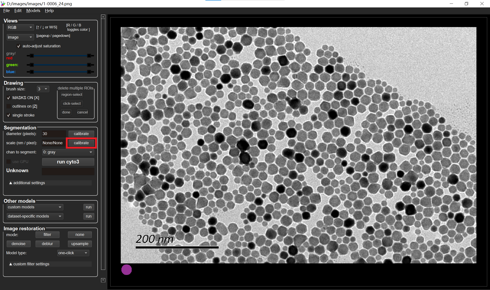

# 
  <b>Sophon </b> 

A generalist algorithm for nanocrystal segmentation in transmission electron microscopy (TEM) images (v1.0).

https://github.com/user-attachments/assets/b16d4648-ace7-4285-81e3-0c6b2e63e904

Download the software from https://github.com/Sharpiless/Nanocrystals-TEM-segmentation/releases/tag/v2.1

## System requirements

The software has been heavily tested on Windows 10.

## Basic usage

The software is built basically on [Cellpose](https://github.com/MouseLand/cellpose).

For basic usage, you can refer to [Cellpose Docs](https://cellpose.readthedocs.io/en/latest/gui.html#using-the-gui).

We show the different parts in the following.

## Calibration

Our modified software support automatically calibrate the scale using modern OCR tools.

Or you can input manually in the text box. Press **Enter** after inputing.

Here is the calibration results (automatical):

## Run segmentation

We provide the checkpoints of a robust segmentation model (**epoch28.pth**).

Select the checkpoints and click **[run]**.

## Export visualization and measurement data

Our software also supports exporting segmentation visualization and measurement data.

These results will be saved to the same folder with the input image.

The pixel-wise and real mesurements are saved to the ".csv" file:

## Train your own model

Please refer to [Training Installation](train/README.md) for installation instructions.

## Deploy your own model

First, add the model to GUI by clicking "Add custom torch model to GUI" in "Models".

Then, select the model by clicking "custom models" in "Other models".

