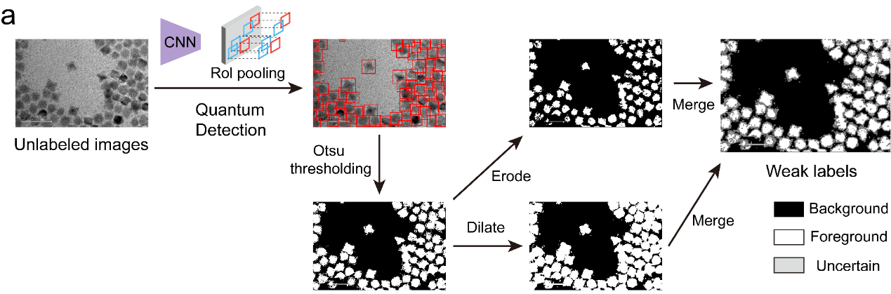

# <p>  <b>Sophon </b> </p>

## Abstract

For nanocrystal segmentation, a neural network based on U-Net is pretrained on our collected hybrid dataset and images with weak labels. The neural network contains an encoder and two decoders, and the output is a triplet: seed maps, horizontal gradients, and vertical gradients, where the horizontal and vertical gradients together solve for the instance maps. The true labels for this triplet can be computed from the segmentation labels' masks and undergo supervised training. For unlabeled data, we use the generated weak label binary masks to partially supervise only the seed maps.

The generation pipeline for the weak labels are shown:



## Download detection model checkpoints

Download the trained detection model from [Google Drive](https://drive.google.com/file/d/1LjQG77xs1NLRVD_MJcI0GInNoZA7VXPX/view?usp=sharing), and place it into "weights" folder:

```
preprocess
├── weights
    ├── cascade_hrnet_rfla_epoch_12.pth
```

## Installation

Please first refer to [Training Installation](train/README.md) for installation instructions.

Then, run:

```
cd preprocess
pip install -r requirements.txt
pip install -U openmim
mim install mmengine
mim install mmcv==2.0.0rc4
pip install -v -e .
```

Check whether the installation is successful:

```
python run.py
```

## Generate weak labels

Assume you have a folder "data/weak_data/images", which contains images without label.

Create an empty folder "data/weak_data/weak_labels" as follows:

```
data
├── ...
├── weak_data
    ├── images
    ├── weak_labels
├── ...
```

Then run:

```
cd preprocess
python predict.py --inputs ../data/weak_data/images --outputs ../data/weak_data/weak_labels
```

Weak labels should be generated and saved to "data/weak_data/weak_labels". One example of weak labels can be visualized as follows:

