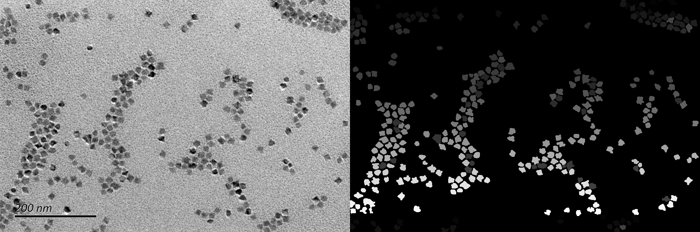
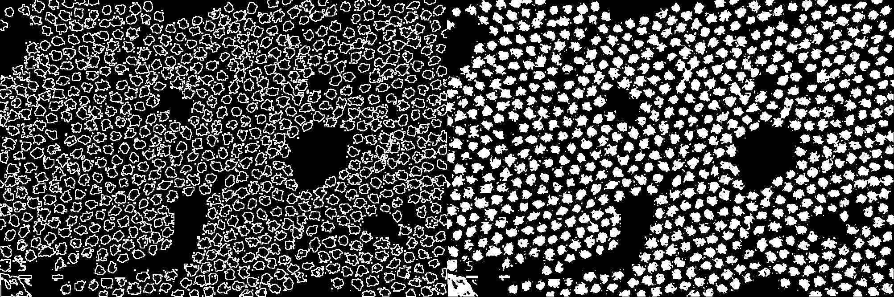

# <p>  <b>Sophon </b> </p>

A generalist algorithm for nanocrystal segmentation in transmission electron microscopy (TEM) images (v1.0).

## Installation
```
conda create -n sophon python=3.8
conda activate sophon
```

here we use pytorch 1.11.0 and CUDA 11.3 for an example 

### install pytorch
```
pip install https://download.pytorch.org/whl/cu113/torch-1.11.0%2Bcu113-cp38-cp38-linux_x86_64.whl
pip install https://download.pytorch.org/whl/cu113/torchvision-0.12.0%2Bcu113-cp38-cp38-linux_x86_64.whl
```

If you don't have cuda, install cpu version:

```
pip install torch==1.11.0 torchvision==0.12.0
```

### install other libs
```
pip install -r requirements.txt
```

## Prepare dataset

[To Do]

The directory structure after pre-processing should be as below:

```
sunrgbd
├── train
    ├── images
        ├── xxx.png
        ├── yyy.png
        ├── ...
    ├── segmaps
        ├── xxx.png
        ├── yyy.png
        ├── ...
├── test
    ├── images
    ├── segmaps
├── weak_data
    ├── images
    ├── weak_labels
├── extra_data
    ├── dataset1
        ├── images
        ├── segmaps
    ├── dataset2
        ├── images
        ├── segmaps
    ├── ...
```

We show one example of training data in "data/examples". They are also visualized as follows:



We show one example of training data in "data/weak_data_examples". The weak labels can be visualized as follows:



Such weak labels can be generated using our detection model. 

See [Preprocess Instruction](../preprocess/README.md) for more details.

## Train your model

See:

```
cd train
bash run.sh
```

The above command will run training process.

- --labeled_data: use labeled dataset in "data/train".
- --extra_data: use all the extra dataset in "data/extra_data".
- --weak_data: use weakly-supervised dataset in "data/weak_data".
- --save_path: where to save your model

An ideal training process is: pre-training and fine-tuning

### Pretrain on extra and weakly-supervised datasets:

```
python train_ours.py \
    --data-dir=data \
    --device=cuda \
    --batch_size=8 \
    --epoch=100 \
    --save_path=runs/extra_weak_pretrain \
    --weak_data \
    --extra_data
```

Pretrained models will be saved to "runs/extra_weak_pretrain".

### Finetune on labeled datasets:

```
python train_ours.py \
    --data-dir=data \
    --device=cuda \
    --batch_size=8 \
    --epoch=100 \
    --save_path=runs/extra_weak_pretrain \
    --labeled_data \
    --ckpt_path=runs/extra_weak_pretrain/best.pth
```

Use "--ckpt_path" to load pretrained checkpoints.

## Deploy your model in GUI

First, add the model to GUI by clicking "Add custom torch model to GUI" in "Models".


Then, select the model by clicking "custom models" in "Other models".

